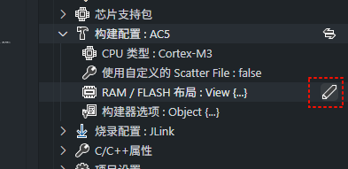

# STM32F10x SPL 项目模板

这是适用于 STM32F10x 的标准库项目模板，使用 ARMCC 5 编译

项目信息：

- 主控：STM32F10x （该模板默认使用 STM32F103C8）
- 标准库版本：V3.5.0
- 所需编译器：ARMCC 5
- 烧录器：JLink

## 切换主控型号

如果要使用同系列的其他型号 比如 `STM32F103ZE`，需要做如下修改：

1. 修改宏定义 `STM32F10X_MD` 为其他值，可用的具体值如下：

  |名称|适用型号|FLash大小|
  |----|----|----|
  |STM32F10X_LD|STM32F101xx, STM32F102xx and STM32F103xx|16 ~ 32 Kbytes|
  |STM32F10X_LD_VL|STM32F100xx|16 ~ 32 Kbytes|
  |STM32F10X_MD|STM32F101xx, STM32F102xx and STM32F103xx|64 ~ 128 Kbytes|
  |STM32F10X_MD_VL|STM32F100xx|64 ~ 128 Kbytes|
  |STM32F10X_HD|STM32F101xx and STM32F103xx|256 ~ 512 Kbytes|
  |STM32F10X_HD_VL|STM32F100xx|256 ~ 512 Kbytes|
  |STM32F10X_XL|STM32F101xx and STM32F103xx|512 ~ 1024 Kbytes|
  |STM32F10X_CL|STM32F105xx and STM32F107xx||


2. 修改工程的 FLASH 大小，点击 `RAM/FLASH 布局` 打开编辑器，修改存储器大小，以匹配主控的实际大小

  


3. 修改 JLink 烧录配置，重新选择芯片型号


修改完成后，执行编译即可

## 默认例程

默认例程功能是翻转 GPIO PA1

main.c
```c
#include "stm32f10x.h"

#define LED_PERIPH RCC_APB2Periph_GPIOA
#define LED_PORT GPIOA
#define LED_PIN GPIO_Pin_1

void delay(int x)
{
    for (int i = 0; i < x; i++)
    {
        for (int j = 0; j < 1000; j++)
            __NOP();
    }
}

int main()
{
    GPIO_InitTypeDef gpioDef;
    RCC_APB2PeriphClockCmd(LED_PERIPH, ENABLE);
    gpioDef.GPIO_Mode = GPIO_Mode_Out_PP;
    gpioDef.GPIO_Pin = LED_PIN;
    gpioDef.GPIO_Speed = GPIO_Speed_10MHz;
    GPIO_Init(LED_PORT, &gpioDef);

    while (1)
    {
        GPIO_WriteBit(LED_PORT, LED_PIN, (BitAction)!GPIO_ReadInputDataBit(LED_PORT, LED_PIN));
        delay(5000);
    }
}
```

## 调试

> 要使用调试功能，需要安装 Cortex-Debug 插件 和 arm-none-eabi-gcc 编译器

arm-none-eabi-gcc 编译器可以使用本插件自动安装，选择设置工具链，选择 GNU Arm Emabedded Toolchain 即可安装

安装完成后，重启 VSCode 实例，重新打开工程

然后按照下图所示，生成一个调试配置模板，**选择 JLink**，然后点击新建，这将在 `launch.json` 中生成一个配置


之后，打开侧边栏的调试栏，选择 `Debug: JLink` 配置，启动调试即可
